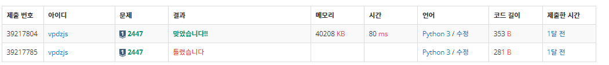
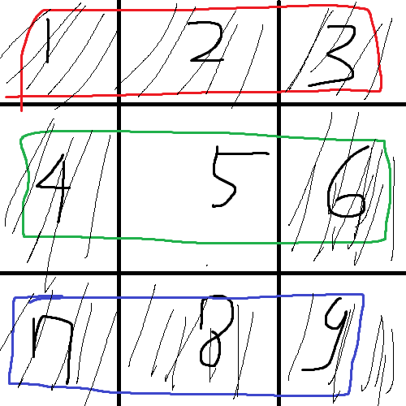

# 백준 2447번 별찍기 -10
# 문제

재귀적인 패턴으로 별을 찍어 보자. N이 3의 거듭제곱(3, 9, 27, ...)이라고 할 때, 크기 N의 패턴은 N×N 정사각형 모양이다.

크기 3의 패턴은 가운데에 공백이 있고, 가운데를 제외한 모든 칸에 별이 하나씩 있는 패턴이다.
```
***
* *
***
```
N이 3보다 클 경우, 크기 N의 패턴은 공백으로 채워진 가운데의 (N/3)×(N/3) 정사각형을 크기 N/3의 패턴으로 둘러싼 형태이다. 예를 들어 크기 27의 패턴은 예제 출력 1과 같다.
# 입력
첫째 줄에 N이 주어진다. N은 3의 거듭제곱이다. 즉 어떤 정수 k에 대해 N=3k이며, 이때 1 ≤ k < 8이다.
# 출력
첫째 줄부터 N번째 줄까지 별을 출력한다.
# 예제 입력 1 
```
27
```
# 예제 출력 1 
```
***************************
* ** ** ** ** ** ** ** ** *
***************************
***   ******   ******   ***
* *   * ** *   * ** *   * *
***   ******   ******   ***
***************************
* ** ** ** ** ** ** ** ** *
***************************
*********         *********
* ** ** *         * ** ** *
*********         *********
***   ***         ***   ***
* *   * *         * *   * *
***   ***         ***   ***
*********         *********
* ** ** *         * ** ** *
*********         *********
***************************
* ** ** ** ** ** ** ** ** *
***************************
***   ******   ******   ***
* *   * ** *   * ** *   * *
***   ******   ******   ***
***************************
* ** ** ** ** ** ** ** ** *
***************************
```
# 풀이 과정
- 이 문제를 한달 전에 방학 때 혼자 공부하다가 재귀 파트에서 풀었었다. 

- 분할 정복 문제이기도 하여서, 쉽지 않은 문제니 복습하는 겸 다시 다뤄보려고 한다.
- 그림처럼(그림프로그램 좀 배워야겠다) 각 행마다 공간을 나눠서 재귀함수로 넣는 방식을 생각했었다. 
- 재귀가 될때마다 길이를 1/3로 줄이고, 길이가 1이 되었을 때 *을 찍는 방식을 채택하였다.
- 하나씩 분할 한 후 다시 *을 찍으며 정복해가는 분할 정복의 방법을 사용한다는 것을 배우고서 알게되었다.


##코드
``` py
import sys 
sys.setrecursionlimit(10**6) 
def star(LEN):
   if LEN == 1: 
     return ['*']
   Stars = star(LEN//3)
   arr = []
   for i in Stars:
    arr.append(i*3)
   for j in Stars:
     arr.append(j+' '*(LEN//3)+j)
   for k in Stars: 
     arr.append(k*3) 
   return arr

n = int(sys.stdin.readline().strip()) 
print('\n'.join(star(n)))

```
- 코드는 혼자 공부했을 당시 제출했던것을 가져왔다. 
- LEN을 3으로 나눈 값을 재귀함수에 넣어서 LEN이 1이 될 때까지 분할하고
- 그 후에 *을 찍어 정복하는 형식으로 이해하였다.
- 당시 3시간동안 머리 싸매고 풀어도 안되어서 여러 풀이들을 봤지만 이 풀이가 제일 깔끔한것 같다.  
- 아직까지도 코드가 완벽하게 이해가 되지 않아서 추가적인 공부를 해야할 것 같다.
- 하지만 분할 정복이 적용된다는 것을 이해한 것은 큰 소득이라 생각한다.

